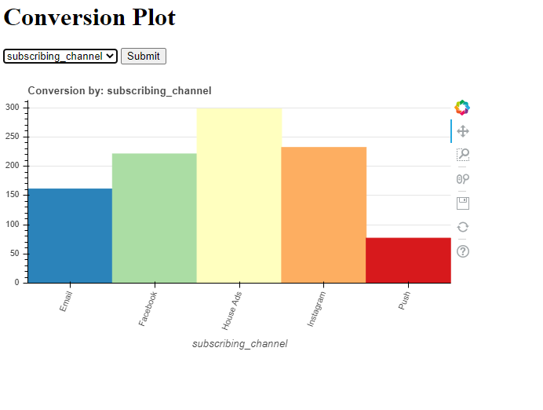

# Flask app deployed on Heroku

This simple app takes input from the user and creates an interactive Bokeh graph using the specified input.

 It is deployed on heroku https://mikayla-flask-app.herokuapp.com/?feature_name=subscribing_channel

